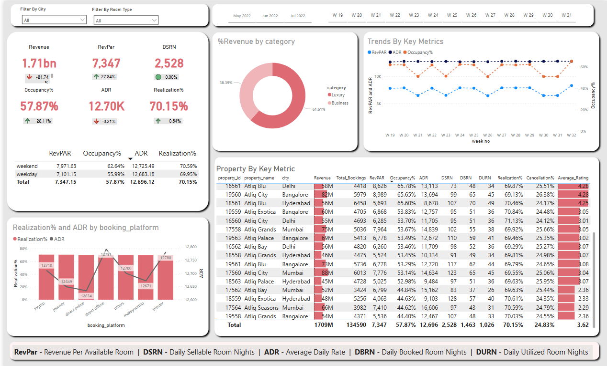

# Project Title

Hospitality Data Visualizations

## Dashboard Snapshot

## Problem Statement

A leading hospitality group has been facing declining market share and revenue in the luxury/business segment due to rising competition and inconsistent decision-making. Lacking an internal analytics team, the organization sought to implement a data-driven solution to extract insights from historical data. This Power BI dashboard project was developed to support strategic decision-making and improve revenue performance.

## Steps Followed

**Step 1**: Loaded multiple `.xlsx` files from a folder into Power BI Desktop.

**Step 2**: Opened Power Query Editor to view and transform the data.

**Step 3**: Split the multiple Excel files into separate tables.

**Step 4**: Cleaned and transformed the tables by removing unnecessary columns and formatting the data as required.

**Step 5**: In the Model View, established a **Star Schema** structure and mapped keys across tables to define relationships.

**Step 6**: In Table View, created calculated columns using DAX, such as:

* `wn = WEEKNUM(dim_date[date])`
* `day type = VAR wkd = WEEKDAY(dim_date[date],1) RETURN IF(wkd>5, "Weekend", "Weekday")`

**Step 7**: Created measures to calculate business KPIs such as:

* `Revenue = SUM(fact_bookings[revenue_realized])`
* `Total Bookings = COUNT(fact_bookings[booking_id])`
* `Total Capacity = SUM(fact_aggregated_bookings[capacity])`
* `Occupancy % = DIVIDE([Total Succesful Bookings],[Total Capacity],0)`
* `Average Rating = AVERAGE(fact_bookings[ratings_given])`
* `No of days = DATEDIFF(MIN(dim_date[date]),MAX(dim_date[date]),DAY) +1`
* `Total cancelled bookings = CALCULATE([Total Bookings],fact_bookings[booking_status]="Cancelled")`
* `Cancellation % = DIVIDE([Total cancelled bookings],[Total Bookings])`
* `Total Checked Out = CALCULATE([Total Bookings],fact_bookings[booking_status]="Checked Out")`
* `Total no show bookings = CALCULATE([Total Bookings],fact_bookings[booking_status]="No Show")`
* `No Show rate % = DIVIDE([Total no show bookings],[Total Bookings])`
* `Booking % by Platform = DIVIDE([Total Bookings], CALCULATE([Total Bookings], ALL(fact_bookings[booking_platform])))*100`
* `Booking % by Room class = DIVIDE([Total Bookings], CALCULATE([Total Bookings], ALL(dim_rooms[room_class])))*100`
* `ADR = DIVIDE([Revenue], [Total Bookings],0)`
* `Realisation % = 1 - ([Cancellation %] + [No Show rate %])`
* `DBRN = DIVIDE([Total Bookings], [No of days])`
* `DSRN = DIVIDE([Total Capacity], [No of days])`
* `DURN = DIVIDE([Total Checked Out],[No of days])`

**Step 8**: Created Week-on-Week change measures to monitor trends:

* `Revenue WoW change %`
* `Occupancy WoW change %`
* `ADR WoW change %`
* `RevPAR WoW change %`
* `Realisation WoW change %`
* `DSRN WoW change %`

These measures use `VAR selv`, `revcw`, `revpw`, and `DIVIDE(revcw, revpw, 0) - 1` pattern to compare current vs previous week performance using `dim_date[wn]`.

## Insights

A single-page dashboard was created on Power BI Desktop which was then saved and uploaded to GitHub as a downloadable file.

### From KPIs

* **Total Revenue**: ₹1.71B with a decline of 81.74%, indicating a sharp drop in performance.
* **RevPAR**: ₹7,347.15, down by 27.84%.
* **Occupancy Rate**: 57.87%, increased by 28.11% — better utilization despite lower revenue.
* **ADR**: ₹12.70K, decreased slightly by 0.21%.

### Weekday vs Weekend Performance

* **RevPAR**: ₹7,971 (weekend) vs ₹7,101 (weekday)
* **Occupancy**: 62.64% vs 55.99%
* **Realisation %**: 70.59% vs 69.95%

### Booking Platform Analysis

* **Tripster**: Highest ADR (₹12,780) with above-average Realisation % — most lucrative.
* **Direct Offline/Online**: Lower Realisation % — OTA platforms are more efficient.

### Averages

* **Average Hotel Rating**: 3.62 / 5 — some properties underperform.
* **Average Occupancy %**: 57.86%

### Property Performance

* Best and worst-performing properties identified using ranking tables.

### Trends Over Time

* **ADR**: Stable between ₹12K–₹13K.
* **Occupancy**: Gradual upward trend with fluctuations.
* **RevPAR**: Mirrors occupancy pattern.

### Category-wise Insights

* **Luxury category** outperforms **Business category** on average in KPIs.
